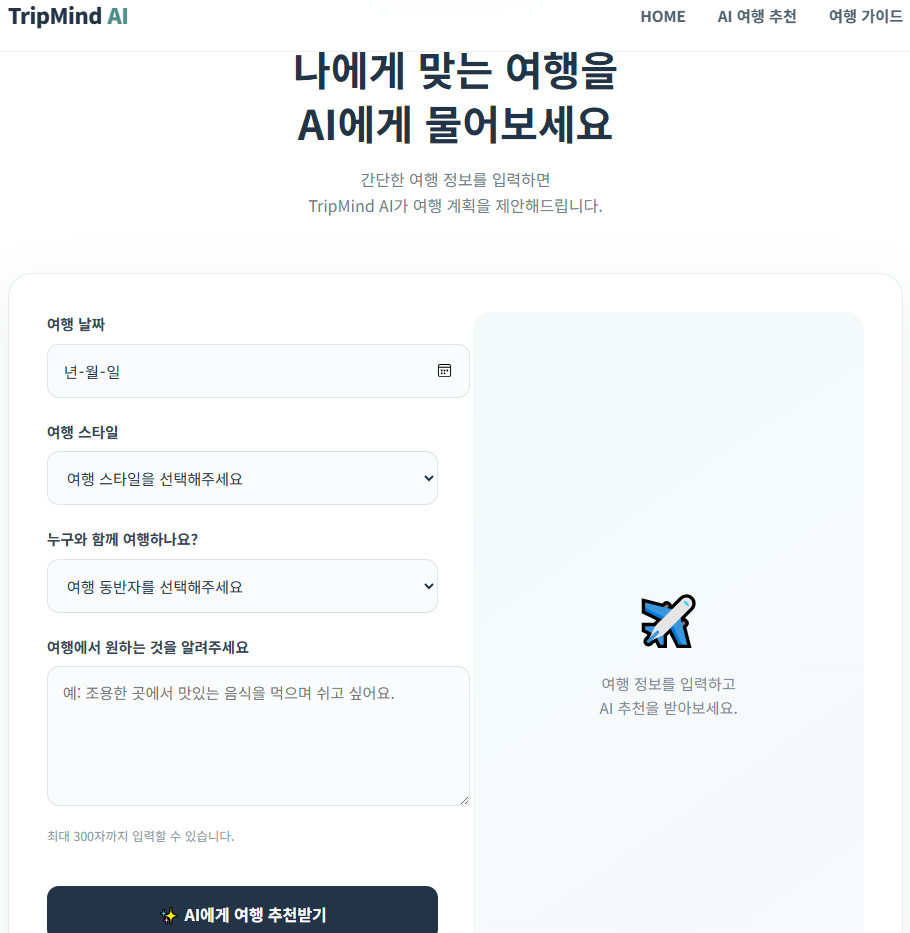
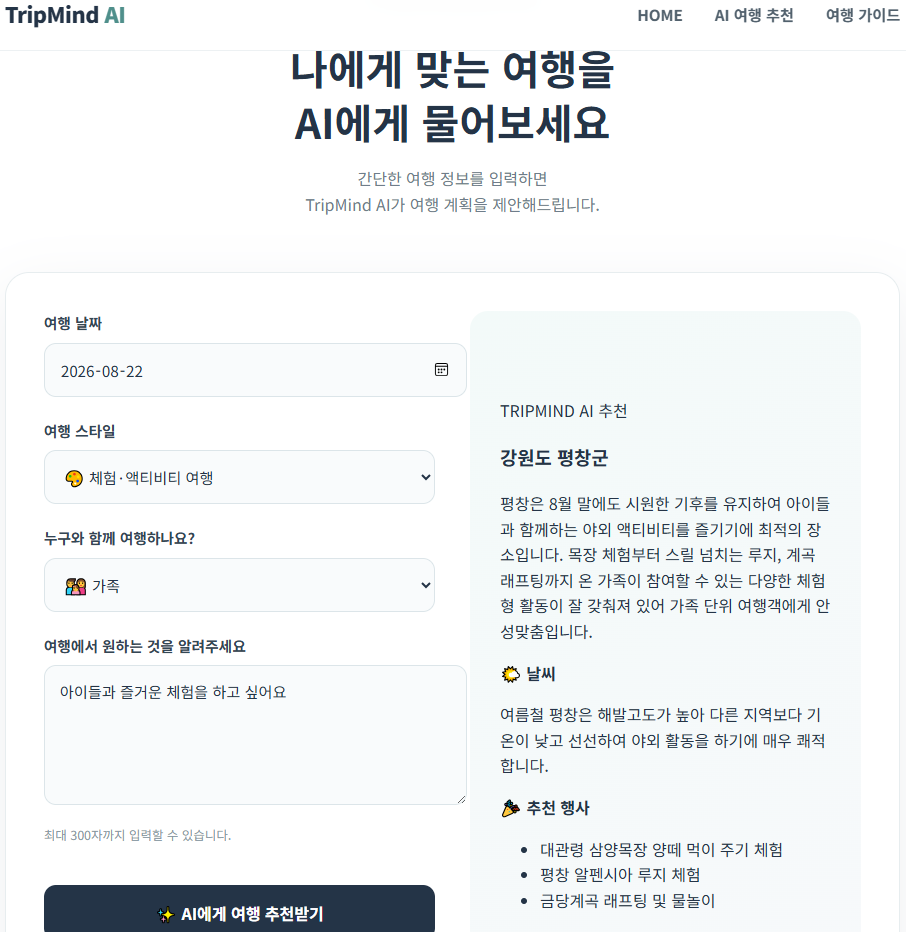
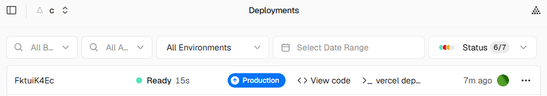
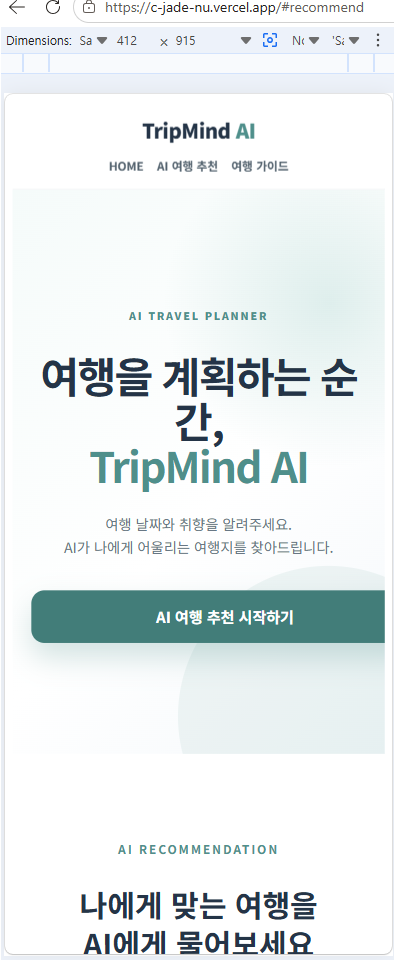

# TripMind AI

Gemini AI를 활용하여 사용자의 여행 조건에 맞는 국내 여행지를 추천하는 AI 여행 플래너 서비스입니다.

여행 날짜, 여행 스타일, 동반자, 추가 요청을 분석하여 추천 여행지와 날씨, 관광 정보를 제공합니다.

---

## 1. 프로젝트 소개

여행지를 선택할 때 여행 날짜, 여행 스타일, 동반자에 따라 적합한 여행지가 달라집니다.

TripMind AI는 이러한 정보를 사용자가 직접 입력하면 AI가 조건을 종합적으로 분석하여 적합한 국내 여행지를 추천하도록 구현했습니다.

또한 실제 웹 서비스로 배포하여 별도의 개발 환경 없이 브라우저에서 서비스를 사용할 수 있도록 구성했습니다.

---

## 2. 주요 기능

* 여행 날짜 입력
* 여행 스타일 선택
* 여행 동반자 선택
* 추가 요청 입력
* Gemini AI 기반 국내 여행지 추천
* 여행 시기의 일반적인 날씨 정보 제공
* 추천 행사 및 관광 포인트 제공
* AI 추천 결과를 웹페이지에서 확인
* Vercel을 이용한 실제 웹 서비스 배포

---

## 3. AI 활용

TripMind AI는 **Google Gemini API**를 사용하여 여행지를 추천합니다.

사용자가 입력한 정보를 Python API로 전달하고, Gemini AI가 다음 조건을 종합적으로 고려하여 여행지를 추천합니다.

* 여행 날짜
* 여행 스타일
* 여행 동반자
* 사용자의 추가 요청

Gemini AI는 다음과 같은 JSON 형태의 결과를 생성합니다.

```json
{
  "recommended_city": "추천 국내 여행지",
  "weather": "여행 시기의 일반적인 날씨 설명",
  "events": [
    "추천 행사 또는 관광 포인트 1",
    "추천 행사 또는 관광 포인트 2"
  ],
  "reason": "추천 이유"
}
```

생성된 결과는 다시 웹페이지로 전달되어 사용자가 보기 쉬운 형태로 표시됩니다.

## AI 오류 처리

사용자 입력 오류와 API 오류 상황에 대응하도록 처리했습니다.

- 필수 입력값 누락:
  "여행 정보를 입력해주세요." 안내

- AI API 오류:
  "잠시 후 다시 시도해주세요." 안내

- 응답 지연:
  로딩 메시지를 표시

---

## 4. 서비스 동작 과정

```text
사용자 여행 정보 입력
        ↓
JavaScript에서 API 요청
        ↓
POST /api/recommend
        ↓
Python Serverless Function
        ↓
Google Gemini API
        ↓
여행지 추천 결과 생성
        ↓
웹페이지에 결과 표시
```

---

## 5. 사용 기술

| 구분         | 기술                    |
| ---------- | --------------------- |
| Frontend   | HTML, CSS, JavaScript |
| Backend    | Python                |
| AI         | Google Gemini API     |
| Python SDK | google-genai          |
| 환경변수 관리    | python-dotenv         |
| 배포         | Vercel                |

---

## 6. 프로젝트 구조

```text
tripmind-ai/
├── api/
│   └── recommend.py
├── css/
├── js/
├── images/
│   ├── 01_tripmind-main.png
│   ├── 02_tripmind-result.png
│   └── 03_vercel-deployment.png
├── index.html
├── pyproject.toml
├── requirements.txt
├── README.md
├── .env.example
└── .gitignore
```

---

## 7. API 구성

### POST /api/recommend

여행 정보를 전달하면 Gemini AI를 이용하여 여행지를 추천합니다.

### 요청 데이터

```json
{
  "date": "2026-08-25",
  "style": "자연 / 힐링",
  "companion": "가족",
  "request": "아이들과 함께 즐길 수 있는 여행지를 추천해주세요."
}
```

### 응답 데이터 예시

```json
{
  "recommended_city": "강원도 평창군",
  "weather": "8월 말 평창의 일반적인 날씨 설명",
  "events": [
    "대관령 양떼목장",
    "루지 체험",
    "워터파크"
  ],
  "reason": "가족 여행과 활동적인 여행 스타일을 고려한 추천"
}
```

---

## 8. 환경변수 설정

Gemini API Key는 보안을 위해 환경변수로 관리합니다.

`.env` 파일에 실제 API Key를 저장합니다.

```text
GEMINI_API_KEY=your_gemini_api_key
```

실제 API Key가 포함된 `.env` 파일은 GitHub에 업로드하지 않습니다.

GitHub에는 `.env.example` 파일만 제공합니다.

```text
GEMINI_API_KEY=your_gemini_api_key_here
```

---

## 9. 실행 방법

### 1. 프로젝트 다운로드

```bash
git clone https://github.com/KimJeongnim/tripmind-ai.git
cd tripmind-ai
```

### 2. 필요한 패키지 설치

```bash
pip install -r requirements.txt
```

### 3. 환경변수 설정

`.env` 파일을 생성하고 Gemini API Key를 입력합니다.

```text
GEMINI_API_KEY=your_gemini_api_key
```

### 4. 웹 서비스 실행

Vercel에 배포된 Production 환경에서 서비스를 실행할 수 있습니다.

배포 주소:

https://c-jade-nu.vercel.app

---

## 10. 배포

Vercel을 이용하여 실제 웹 서비스로 배포했습니다.

### Production

https://c-jade-nu.vercel.app

배포 후 실제 서비스에서 여행 정보를 입력하고 Gemini AI의 여행 추천 결과가 정상적으로 생성되는 것을 확인했습니다.

---

## 11. 실행 화면

### ① TripMind AI 입력 및 추천 화면



### ② AI 여행 추천 결과



### ③ Vercel Production 배포



### ④ 모바일 화면



---

## 12. 구현 결과

TripMind AI는 사용자의 여행 정보를 입력받아 Gemini AI를 통해 국내 여행지를 추천하고, 추천 여행지의 날씨와 행사 및 관광 포인트를 제공하는 웹 서비스를 구현했습니다.

또한 Vercel을 통해 Production 환경에 배포하여 실제 웹 브라우저에서 AI 여행 추천 기능이 정상적으로 동작하는 것을 확인했습니다.
